  <a href="https://varac.io">
    <picture>
      <source media="(prefers-color-scheme: dark)" srcset="assets/banner-dark.svg">
      <source media="(prefers-color-scheme: light)" srcset="assets/banner-light.svg">
      
    </picture>
  </a>

# Víctor Varela Carranza

### Ingeniero Ambiental · Desarrollador de IA · CEO de VARAC

 

  

🌐 **VARAC:** <a href="https://varac.io" target="_blank"><b>varac.io</b></a> — eficiencia operacional impulsada por IA para los sectores ambiental, energético, geoespacial, agro e industrial.

---

## Sobre mí

**Ingeniero Ambiental que construye sistemas de IA — no al revés.** Mi primer oficio fue **auditar**: levantar evidencia y firmar un dictamen capaz de resistir cualquier revisión. Hoy construyo sistemas de IA que **nacen auditables** — gobernanza, trazabilidad y calidad del dato de serie, no como parche.

Trabajo **AI-native**: la IA está tejida en todo mi ciclo de desarrollo — harness de agentes *self-hosted* con sandboxing en Docker, desarrollo *spec-driven* y agentes end-to-end en producción. He dirigido equipos técnicos de I+D y hoy defino la arquitectura y los estándares de ingeniería de cada proyecto de VARAC. Cuando no estoy construyendo, doy conferencias sobre IA + sustentabilidad para públicos técnicos, empresariales y estudiantiles.

Mis sistemas no viven en demos: **cruzan del software al mundo físico** — visión por computadora, sensores, PLC, drones y vehículos autónomos — y regresan como datos confiables para decidir.

---

## Stack

<b>IA & Agentes</b> <i>(competitive edge)</i>

 

  
  
  
  
  
  

<b>Geoespacial</b>

 

  
  
  
  
  

<b>Hardware & Visión</b> <i>(IA física)</i>

 

  
  
  
  
  
  

<b>Backend & Infra</b>

 

  
  
  
  
  
  
  
  

<b>Ambiental & Regulatorio</b>

 

  
  
  
  

---

## Experiencia

> **`2018 — Presente`** · **VARAC** · *Puebla, MX*  
> **Fundador y CEO**  
> Firma de eficiencia operacional impulsada por IA: consultoría estratégica, business intelligence, agentes de IA, gemelos digitales y AI as a Service para clientes de los sectores ambiental, energético, agro e industrial.

> **`2023 — Presente`** · **AIGIS PRO** · *Puebla, MX*  
> **Fundador**  
> Plataforma de análisis geoespacial impulsada por LLMs — preguntas en lenguaje natural convertidas en mapas, capas y análisis territoriales. En uso con clientes reales de consultoría ambiental y energética.

> **`2025 — 2026`** · **enerbook** · *Remoto*  
> **Ingeniero de Software**  
> Sistemas de viabilidad solar fotovoltaica: evaluación técnica y económica con análisis geoespacial y de terreno por ubicación.

> **`2023 — 2025`** · **CETAMEX** · *Puebla, MX*  
> **Director de Investigación y Desarrollo**  
> IA aplicada al tratamiento de aguas residuales; liderazgo del equipo técnico de I+D, estándares de datos y documentación.

---

## Sistemas construidos

<table>
  <tr>
    <td valign="top" colspan="2">
      <h3>🌎 AIGIS PRO — Análisis geoespacial con IA</h3>
      
Preguntas en lenguaje natural → mapas, capas y análisis territoriales <b>en segundos</b>. Pipeline LLM end-to-end en español con RAG geoespacial, evaluación continua de calidad y trazabilidad de cada consulta. <b>En producción con clientes reales</b> de consultoría ambiental y energética; en desarrollo: análisis multicapa con LiDAR.

      

        
        
        
        
        
      

      
    </td>
  </tr>
  <tr>
    <td width="50%" valign="top">
      <h3>🤖 AGV — Vehículo de guiado automático</h3>
      
Vehículo autónomo industrial desarrollado en conjunto con <b>Limser</b> y presentado en <b>Americas Mobility of the Future 2025</b>. Navegación, sensórica y control — IA operando sobre hardware real.

      

        
        
        
      

    </td>
    <td width="50%" valign="top">
      <h3>🐟 Sistema acuapónico inteligente</h3>
      
Regulación automática de un ecosistema vivo: monitoreo de peces, plantas y parámetros del agua en tiempo real con visión por computadora, ML y LLMs. Proyecto reconocido (CAY, INODROP 2024).

      

        
        
        
      

    </td>
  </tr>
  <tr>
    <td width="50%" valign="top">
      <h3>🔥 Predicción de incendios forestales</h3>
      
Modelo de riesgo para el Parque Nacional La Malinche con Random Forest y teledetección (Landsat, Sentinel, MODIS). Costo de datos: <b>$0</b> — todo con satélites abiertos.

      

        
        
        
      

    </td>
    <td width="50%" valign="top">
      <h3>💧 IA para tratamiento de aguas residuales</h3>
      
Optimización de procesos de purificación, dosificación y gestión hídrica con modelos de IA (CETAMEX). Diseño de software para plantas de tratamiento con reconocimiento nacional.

      

        
        
        
      

    </td>
  </tr>
</table>

---

## Conferencias y reconocimientos

- 🎤 **Smart City 2024** · Mérida, Yucatán — *IA al servicio de la sustentabilidad y green apps*
- 🎤 **EcoFest Cuautlancingo 2026** — *IA: tu copiloto digital para un futuro sostenible*
- 🏆 **INODROP 2024** (IA en acuaponía y tratamiento de aguas) · **Vozfera 2025** (AIGIS PRO)

---

## Conectemos

  

📍 Puebla, México · 🌎 Proyectos remotos e internacionales · 🗣️ Español (nativo) · English (C1)

---

 

  <a href="#-english-version">🇬🇧 English version ↓</a>

 

---

## 🇬🇧 English version

### Víctor Varela Carranza

### Environmental Engineer · AI Developer · CEO at VARAC

**An Environmental Engineer who builds AI systems — not the other way around.** My first craft was **auditing**: gathering evidence and signing findings that can withstand any review. Today I build AI systems that are **auditable by design** — governance, traceability, and data quality built in, not bolted on.

I work **AI-native**: AI is woven through my entire development cycle — a self-hosted agent harness with Docker sandboxing, spec-driven development, and end-to-end agents in production. Founder & CEO of **[VARAC](https://varac.io)**, an AI-powered operational efficiency firm, and creator of **AIGIS PRO** — a geospatial analysis platform that turns natural-language questions into maps, layers, and territorial insights, **in production with real clients** in environmental and energy consulting.

My systems cross from software into the physical world and back: an **AGV showcased at Americas Mobility of the Future 2025** (with Limser), computer-vision aquaponics running on live sensors, wildfire-risk prediction from open satellite data, and AI for wastewater treatment. I've led R&D teams and now set the architecture and engineering standards for every VARAC project.

📍 Puebla, Mexico · Open to remote and international projects · **[varac.io](https://varac.io)** · [LinkedIn](https://www.linkedin.com/in/victor-varela-carranza) · [victor@varac.io](mailto:victor@varac.io)

---

  

<i>"La IA no salva al planeta sola — el criterio humano firma."</i>

